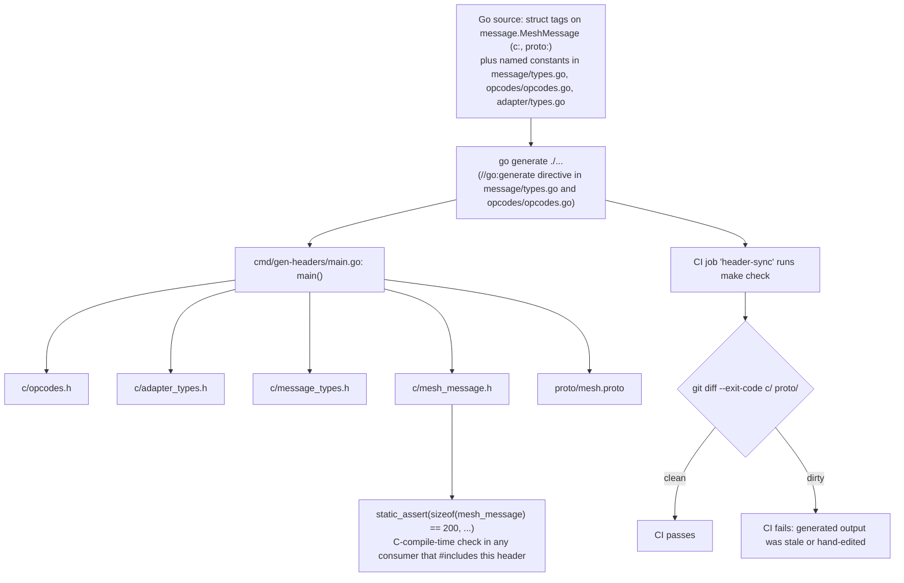

# Codegen pipeline

`lattice-protocol`'s Go source is the single source of truth for the wire format and the
opcode/adapter-type/message-type constants. Nothing under `c/` or `proto/mesh.proto` is ever
hand-edited — every file there is regenerated by `cmd/gen-headers/main.go` and is checked into
the repo only so consumers (`lattice-nodes`, `lattice-hub`) have something to vendor/import
without running Go tooling themselves. This doc walks the pipeline end to end: where the source
of truth lives, how to regenerate, how a size-drift bug gets caught, and — just as important —
where it *doesn't* get caught.

## Pipeline at a glance



## Walkthrough

### 1. Source of truth: struct tags and named constants

Two different mechanisms feed the generator, and they aren't interchangeable:

- **`message.MeshMessage`** (in `message/message.go`) is generated by **reflection over struct
  tags**. Each field carries a `c:"..."` tag (the C type, e.g. `uint8_t[6]`) and a
  `proto:"fieldNum,protoType[,optional][,protoName]"` tag. `writeMeshMessageHeader` and
  `writeMeshProto` both call `reflect.TypeOf(message.MeshMessage{})` and iterate `t.Field(i)`,
  reading `field.Tag.Get("c")` / `field.Tag.Get("proto")` to decide what to emit. Adding a new
  tagged field to the struct is enough to make it show up in both `c/mesh_message.h` and
  `proto/mesh.proto` the next time codegen runs.
- **The constant packages** — `message/types.go` (`MeshType*`), `opcodes/opcodes.go` (`Op*`), and
  `adapter/types.go` (`Type*`) — are **not** reflected over at all (Go constants don't carry
  runtime tags). Instead, `writeOpcodesHeader`, `writeAdapterTypesHeader`, and
  `writeMeshMessageTypesHeader` each contain a hardcoded call per constant, e.g.:

  ```go
  writeCDefByte(f, "OP_HEALTH_REQ", opcodes.OpHealthReq, "server→node: request health; payload: [B0]")
  ```

  The *value* written is always the live Go constant (referenced by name, compiled in), but the
  *set* of constants emitted — and their description text — is a separate list maintained by hand
  in `main.go`. Adding a new opcode/adapter-type/message-type constant to its source package does
  **not** automatically appear in the generated header; a matching `writeCDef*` call must be added
  to `main.go` too, or the new constant silently won't be emitted.

### 2. Running codegen: `go generate ./...`

Both `message/types.go` and `opcodes/opcodes.go` carry the same directive:

```go
//go:generate go run ../cmd/gen-headers/main.go
```

Running `go generate ./...` from the repo root triggers this once per package that declares it —
so it invokes `go run ../cmd/gen-headers/main.go` twice (once while processing `message/`, once
while processing `opcodes/`). That's harmless: each run overwrites the same five output files
with identical content, so the second run is a no-op diff. `adapter/types.go` has no
`//go:generate` directive of its own; its constants are picked up because the generator binary
(triggered by the other two packages) imports the `adapter` package directly.

The `Makefile`'s `generate` target is just this command:

```make
generate:
	go generate ./...
```

### 3. What `cmd/gen-headers/main.go` writes

`main()` calls exactly five write functions, each producing one file:

| Function | Output |
|---|---|
| `writeOpcodesHeader` | `c/opcodes.h` |
| `writeAdapterTypesHeader` | `c/adapter_types.h` |
| `writeMeshMessageTypesHeader` | `c/message_types.h` |
| `writeMeshMessageHeader` | `c/mesh_message.h` |
| `writeMeshProto` | `proto/mesh.proto` |

Every one of these files opens with `// Code generated by cmd/gen-headers; DO NOT EDIT.` followed
by a `// Source of truth: <file> — run "go generate ./..." to regenerate.` line pointing back at
the Go file that drives it. (Note: `main.go`'s own top-of-file comment — "gen-headers generates
c/opcodes.h, c/adapter_types.h, c/message_types.h, and c/mesh_message.h from the Go constants" —
doesn't mention `proto/mesh.proto`, even though `main()` clearly writes it. Don't rely on that
comment as the complete list; the five-function table above is current as of this writing.)

### 4. The size guard: `static_assert` in `c/mesh_message.h`

`writeMeshMessageHeader` emits the packed struct followed by:

```c
static_assert(sizeof(mesh_message) == 200, "mesh_message size changed — update server proto");
```

The `200` is `message.WireSize`, a Go constant maintained by hand in `message/message.go` with a
comment justifying the arithmetic (`127 (v2 prefix) + 1 + 48 + 16 + 8 = 200`). Nothing computes
`WireSize` from the struct's tagged field widths automatically — it's a second, independent
number a human must update in lockstep with `MeshMessage`'s field tags. The `static_assert` is
what catches a mismatch between the two: if someone adds or resizes a `c:`-tagged field without
also updating `WireSize`, `go generate` will still run without complaint and emit a header that
fails to compile.

That's a **C-compile-time** check, which matters because of what `lattice-protocol`'s own CI does
and doesn't do: none of its three jobs (`go-test`, `header-sync`, `go-lint`) invoke a C/C++
compiler. `header-sync` only regenerates and diffs text (see below) — it never compiles
`c/mesh_message.h`. So a `WireSize`/struct-tag mismatch is **not** caught in this repo's own CI;
it's only caught the first time a downstream consumer (`lattice-nodes`, which vendors `c/` as a
submodule and compiles it as part of ESP-IDF firmware) actually builds against the new header.

### 5. CI enforcement: the `header-sync` job

`.github/workflows/ci.yml` has a `header-sync` job whose only step is:

```yaml
- name: Check C headers are in sync with Go constants
  run: make check
```

`make check`'s definition in the `Makefile`:

```make
check: generate
	git diff --exit-code c/ proto/
```

i.e. `check` depends on `generate` (`go generate ./...`), then diffs the working tree against the
committed state for `c/` and `proto/`. If regenerating produces byte-for-byte the same files
already committed, the diff is empty and the job passes. If a contributor edited `opcodes/opcodes.go`
but forgot to run `go generate` before committing — or hand-edited a generated file directly — the
diff is non-empty and the job fails. This is what actually enforces "generated output is never
hand-edited or stale"; it's a text diff, not a semantic check, and it doesn't compile anything.

## Known gap: `proto/mesh.options` is hand-maintained

`proto/mesh.options` is a [nanopb](https://jpa.kapsi.fi/nanopb/) options file — for each
`bytes` field in `mesh.proto` it declares a `max_size` used to size the field in generated nanopb
C structs. Unlike every file in `c/` and `proto/mesh.proto` itself, it is:

- **Not generated.** `main()` calls only `writeOpcodesHeader`, `writeAdapterTypesHeader`,
  `writeMeshMessageTypesHeader`, `writeMeshMessageHeader`, and `writeMeshProto`. There is no
  `mesh.options` writer anywhere in `cmd/gen-headers/main.go` — grepping the file for
  `mesh.options` or `MeshOptions` returns no matches.
- **Not marked as generated.** It has no `// Code generated ... DO NOT EDIT` banner or any header
  comment at all, unlike every file under `c/` and `proto/mesh.proto`, which all open with one.
  Nothing in the file warns an editor that it needs manual attention when the wire format changes.
- **Not effectively checked by CI**, despite living inside the `proto/` directory that
  `make check`'s `git diff --exit-code c/ proto/` scans. The `generate` step that runs first never
  touches `mesh.options`, so there is no freshly-regenerated "expected" version to diff the
  committed one against — `git diff` can only surface a difference between the working tree and
  the committed file, and in CI those are the same checkout. A `mesh.options` that's missing an
  entry for a new `bytes` field, or that has a stale `max_size` for one that was resized, commits
  and merges cleanly. CI will not fail.

**Practical consequence:** if you add a new `bytes`/`string` field to `message.MeshMessage`, or
change the size of an existing one (e.g. `RoutePath`'s `48` in the `c:` tag), you must manually
add or update the matching `max_size:` line in `proto/mesh.options` yourself. Nothing in this
repo's tooling will remind you, and nothing will catch it if you forget — this is a real,
currently-unmitigated risk, not something the existing CI already handles.
